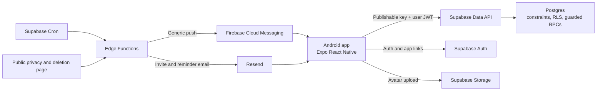

# Technical architecture

Version: 0.1 proposed  
Date: 25 July 2026  
Status: Planning only

## Architecture decision

Build a standalone Expo React Native application backed by a dedicated
Supabase project. Reuse the biz-os recognition engine as reviewed source
material, then adapt and retest it inside this repository. Do not call the
biz-os application or database at runtime.

## Why this stack

### Expo SDK 56 and React Native

- Expo SDK 56 is the current stable Expo release at the time of planning.
- It uses React Native 0.85 and supports Android API level 36.
- React Native has supported 16 KB memory pages since 0.77.
- It provides native navigation, notifications, secure storage, app links,
  Android builds and Play submission without recreating a native toolchain.
- TypeScript domain logic from biz-os can be adapted without translating it to
  Kotlin.

### Supabase

- The existing module already expresses its strongest rules in Postgres.
- Supabase provides Auth, Postgres, RLS, Storage, Edge Functions and Cron in one
  deployable system.
- A dedicated project keeps the product operationally separate from biz-os.
- The Pro plan is a practical production starting point with backups and no
  inactivity pause.

### Direct FCM delivery

Use `expo-notifications` for permission and native token handling, but send
through Firebase Cloud Messaging HTTP v1 from a trusted server function.

- The app obtains a native FCM token using
  `getDevicePushTokenAsync()`.
- A Supabase Edge Function sends through FCM HTTP v1.
- Firebase credentials stay in the server secret store.
- This avoids routing message content through the Expo Push Service.
- Notification bodies remain generic and carry only a route and opaque cycle
  ID.

This is a P0 technical spike. If service-account signing is awkward in the Edge
runtime, the fallback is Expo Push Service with updated privacy disclosures.

## System context



## Repository structure

The proposed layout is:

```text
.
|-- app/                         Expo Router routes and layouts
|   |-- (auth)/
|   |-- (member)/
|   |-- (admin)/
|   `-- settings/
|-- src/
|   |-- components/              shared accessible UI
|   |-- domain/recognition/      pure deterministic rules
|   |-- features/                feature services, screens and hooks
|   |-- lib/                     Supabase, dates, logging and config
|   |-- state/                   session and active organisation state
|   `-- types/                   generated database and app types
|-- supabase/
|   |-- functions/               invitations, notifications, deletion
|   |-- migrations/              forward-only schema
|   |-- seed.sql                 deterministic non-production fixtures
|   `-- tests/                   pgTAP / SQL security and invariant tests
|-- e2e/                         Maestro critical journeys
|-- assets/                      app icon, splash and store assets
|-- docs/
|-- KANBAN.md
`-- package.json
```

## Client architecture

### Navigation

Use Expo Router with explicit route groups:

- `(auth)`: sign-in, verification, recovery and invitation acceptance.
- `(member)`: current cycle, nominate, own ballot and result history.
- `(admin)`: setup, roster, cycle, turnout, moderation, tie and reveal.
- `settings`: profile, notification preferences, privacy, leave and deletion.

Server authorisation remains authoritative. Route guards improve the experience
but do not grant access.

### State and data

- Supabase session is the authentication source.
- TanStack Query is proposed for server state, retry policy and cache
  invalidation.
- Keep local UI state local. Do not duplicate server entities into a global
  mutable store.
- Cache participant names and revealed history, but never persist another
  user's nomination or administrator moderation payload to unencrypted general
  storage.
- Store session material using the Supabase-supported React Native storage
  pattern and platform secure storage where compatible.
- Do not implement an offline ballot queue. A ballot is complete only after the
  server confirms it.

### Error model

Map database and function errors into stable product codes:

- `cycle_not_open`
- `already_nominated`
- `self_nomination`
- `not_eligible_to_vote`
- `nominee_not_eligible`
- `cross_organisation`
- `invitation_expired`
- `invitation_consumed`
- `permission_denied`
- `tie_resolution_invalid`

Screens render plain user messages. Logs record the code, request correlation
ID and coarse route, never nomination content.

## Data model

Names are proposed and may change during the schema spike.

### Identity and organisation

#### `profiles`

| Column | Notes |
|---|---|
| `user_id uuid primary key` | References `auth.users`; immutable |
| `display_name text` | User-controlled account display |
| `created_at`, `updated_at` | Audit timestamps |

#### `organisations`

| Column | Notes |
|---|---|
| `id uuid primary key` | Tenant boundary |
| `name text` | 1 to 100 characters |
| `timezone text` | Valid IANA timezone |
| `created_by uuid` | Initial owner |
| `created_at`, `updated_at`, `deleted_at` | Lifecycle |

#### `organisation_members`

| Column | Notes |
|---|---|
| `organisation_id uuid` | Composite tenant key |
| `user_id uuid` | Immutable auth link |
| `role text` | `owner`, `admin`, `member` |
| `status text` | `active`, `suspended`, `left` |
| `joined_at` | Membership evidence |

Unique key: `(organisation_id, user_id)`.

#### `participants`

The programme roster, including people who have not accepted an account.

| Column | Notes |
|---|---|
| `id uuid` | Participant ID |
| `organisation_id uuid` | Tenant |
| `user_id uuid null` | Linked only during guarded invitation acceptance |
| `display_name text` | Roster name |
| `team text` | Optional |
| `avatar_path text` | Private Storage object path |
| `active boolean` | Roster lifecycle |
| `can_vote boolean` | Separate voter eligibility |
| `can_receive boolean` | Separate nominee eligibility |
| `created_at`, `updated_at`, `left_at` | Lifecycle |

Unique partial constraints prevent two active participant links for one user in
one organisation.

#### `organisation_invitations`

| Column | Notes |
|---|---|
| `id uuid` | Invitation ID |
| `organisation_id`, `participant_id` | Tenant-coherent relation |
| `email_normalised text` | Admin-only, never included in ballot APIs |
| `token_hash text` | SHA-256 or stronger hash, never plaintext token |
| `expires_at`, `accepted_at`, `revoked_at` | Single-use lifecycle |
| `created_by` | Administrator |

Invitation acceptance runs in one guarded transaction and verifies the
authenticated email. Email matching is only a claim check during token
redemption, never a background identity-linking mechanism.

### Recognition

#### `recognition_cycles`

| Column | Notes |
|---|---|
| `id`, `organisation_id` | Tenant key |
| `period_month date` | First day only |
| `status text` | State machine |
| `criteria text` | Snapshotted for the month |
| `leaderboard_mode text` | Fixed `hidden` in v1, retained for migration |
| `opens_at`, `closes_at` | UTC instants |
| `winner_participant_id` | Snapshot reference, not cascading FK |
| `winner_name`, `winner_nominations` | Durable result |
| `tie_decision_note` | Required for tied reveal |
| `revealed_at`, `revealed_by` | Audit |

Unique: `(organisation_id, period_month)`.

#### `recognition_nominations`

| Column | Notes |
|---|---|
| `id`, `organisation_id`, `cycle_id` | Tenant-coherent ballot |
| `nominator_user_id` | Internal integrity key |
| `nominee_participant_id` | Chosen colleague |
| `reason text` | Maximum 500 characters |
| `status text` | `active`, `hidden`, `withdrawn` or use deletion plus audit |
| `moderated_by`, `moderated_at`, `moderation_reason` | Governance |
| `created_at`, `updated_at` | Stored, but excluded from admin payload while open |

Unique: `(organisation_id, cycle_id, nominator_user_id)`.

The schema spike must choose between physical withdrawal and a `withdrawn`
state. A state is better for auditability but the unique slot must still allow
one recast. The recommended design is a separate immutable
`recognition_ballot_events` audit table plus one mutable current nomination row,
updated only through guarded functions.

#### `recognition_settings`

- `retention_months`
- push and email reminder defaults
- criteria template
- last purge time

### Delivery and audit

#### `device_push_tokens`

- User and organisation relation.
- Native FCM token encrypted or protected at rest.
- Platform, app version, last seen, disabled time and last delivery result.
- Unique token.
- A user can revoke each device.

#### `notification_deliveries`

- Idempotency key, event type, user, cycle, channel, attempt, result and coarse
  error.
- No nomination or winner content.

#### `audit_events`

- Organisation, actor, action, entity type, entity ID, timestamp and safe JSON
  metadata.
- A nomination-cast event identifies the cycle, not voter or nominee.
- Winner reveal may name the winner because the result is public inside the
  organisation.

#### `privacy_requests`

- Requester, request type, state, received, due, completed and operator note.
- Does not replace a support or legal case system, but makes product workflows
  traceable.

## Database invariants

The following rules must hold even for service-side writes:

1. Every cross-table relation is tenant coherent.
2. Organisation ID is immutable after insert.
3. One normalised cycle per organisation per month.
4. Only legal cycle transitions occur.
5. Only an open cycle accepts ballot changes.
6. Voter is a linked, active participant with `can_vote`.
7. Nominee is active with `can_receive`.
8. Voter cannot nominate their participant record.
9. One current nomination slot per voter and cycle.
10. A clear tally cannot be overridden during reveal.
11. A tied winner must be a joint leader and carry a decision note.
12. A revealed cycle cannot reopen.
13. Raw nomination data cannot be selected by another member or normal
    administrator role.

Constraints handle uniqueness and tenant keys. Trigger functions or transaction
functions handle stateful rules. Client checks exist only to provide earlier,
clearer messages.

## API surface

Prefer a small explicit RPC surface for sensitive workflows:

- `create_organisation(name, timezone)`
- `accept_invitation(token)`
- `create_cycle(period, criteria, opens_at, closes_at)`
- `transition_cycle(cycle_id, expected_version, next_status)`
- `cast_nomination(cycle_id, nominee_id, reason, idempotency_key)`
- `withdraw_nomination(cycle_id)`
- `get_my_nomination(cycle_id)`
- `get_cycle_turnout(cycle_id)`
- `get_admin_nominations(cycle_id)` with confidentiality-safe shape
- `moderate_nomination(nomination_id, action, reason)`
- `get_closed_standings(cycle_id)`
- `reveal_winner(cycle_id, tied_participant_id, decision_note)`
- `request_account_deletion()`

Use optimistic concurrency through an integer `version` or expected state on
cycle mutations so two administrators cannot close and reopen over each other.

### Supabase 2026 Data API change

New Supabase tables are no longer automatically exposed to Data and GraphQL
APIs by default. Migrations must therefore:

- explicitly choose which schema is exposed;
- explicitly grant only required table and function access;
- enable RLS on every exposed table;
- revoke default `PUBLIC` execute on functions;
- expose sensitive behaviour through reviewed functions, not broad table
  grants.

This is separate from RLS and must be tested independently.

## RLS model

Policy helpers live in a non-exposed `private` schema:

- `private.is_org_member(org_id)`
- `private.has_org_role(org_id, roles[])`
- `private.participant_for_user(org_id, auth.uid())`

Rules:

- Never authorise from `raw_user_meta_data`.
- `TO authenticated` is not sufficient without a tenant and ownership
  predicate.
- Update policies include both `USING` and `WITH CHECK`.
- Views use `security_invoker = true` or remain inaccessible.
- Security-definer functions are exceptional, live outside exposed schemas,
  validate `auth.uid()` and have explicit execute grants.
- Do not grant administrators raw nomination selection. Use a shaped function.
- Service-role use is restricted to server functions and never shipped to the
  app.

## Storage

- Avatars use a private bucket.
- Object path includes organisation and participant IDs.
- Signed read URLs are short-lived.
- Restrict MIME type to JPEG, PNG and WebP.
- Resize/compress on device before upload.
- V1 maximum is 2 MB after processing.
- Storage policies verify both organisation membership and participant
  management role.
- Replace requires insert, select and update permissions.
- Deleting a participant schedules object cleanup.

## Scheduled work

Supabase Cron uses `pg_cron`. The platform recommends no more than eight
concurrent jobs and a maximum runtime of 10 minutes.

Proposed jobs:

| Job | Schedule | Behaviour |
|---|---|---|
| Invitation expiry | Hourly | Mark expired, no email |
| Cycle reminder | Hourly | Select open cycles in local reminder window, send once |
| Retention sweep | Daily | Dry-run capable, purge eligible revealed ballots |
| Deletion worker | Every 15 minutes | Process verified requests and retries |
| Delivery cleanup | Daily | Remove stale disabled push tokens |

Each job uses a unique business idempotency key and records start, end, count
and failure without ballot content.

## Notification security

- Request Android 13+ notification permission in context.
- Define a low-noise `recognition` notification channel.
- Do not request exact-alarm permission.
- Do not include employee names or reasons in lock-screen payloads.
- Treat push tokens as personal data.
- Store Firebase service credentials only as server secrets.
- Rotate credentials after suspected exposure.
- Disable tokens on FCM unregistered responses.

## Privacy architecture

### Controller and processor model

The intended model is that the customer organisation decides why and how its
employee recognition programme operates and is the controller. The product
operator acts as processor for that tenant, while remaining controller for
direct account, security, billing and product-operation data. This needs legal
review and matching terms, privacy notice and data processing agreement.

### Minimisation

- No contacts, location, advertising ID or background tracking.
- No special-category fields.
- Warn against sensitive content in reasons.
- No nomination text in email, push, logs, analytics or crash reports.
- Separate public winner snapshots from raw ballot retention.
- Coarsen or omit timestamps in confidentiality-sensitive admin responses.

### Deletion order

1. Authenticate and re-confirm destructive intent.
2. Resolve sole-owner dependency.
3. Revoke sessions and device tokens.
4. Delete or anonymise user-owned app data in a transaction.
5. Delete the Auth user from a trusted function.
6. Record a non-identifying completion receipt.
7. Send completion email only if still lawful and required.

Deleting an Auth user alone does not immediately invalidate all access tokens,
so session revocation precedes deletion.

## Testing strategy

### Pure domain tests

- Month key and timezone boundaries.
- State transitions.
- Eligible voters and recipients.
- Duplicate, self and closed-cycle refusals.
- Tally, shared rank, zero votes and ties.
- Retention cutoff arithmetic.

### Database tests

Test each operation as:

- signed out;
- member in the same organisation;
- admin in the same organisation;
- owner in the same organisation;
- member/admin in another organisation;
- trusted server role.

Include adversarial direct Data API attempts, not only RPC happy paths.

### Component and integration tests

- Authentication and invitation errors.
- Font scaling and screen-reader labels.
- Slow and offline ballot submission.
- Double taps and retries.
- Notification permission denied.
- Administrator concurrency.
- Account deletion and ownership transfer.

### End-to-end tests

Maestro flows:

1. Owner creates organisation and opens a cycle.
2. Two invitees join.
3. Self-vote is blocked.
4. Each member casts one vote.
5. Duplicate is blocked.
6. Admin sees turnout but no live standings or voter identity.
7. Admin closes and reveals.
8. Member sees result.
9. Member requests export and deletion.

### Release verification

- `expo-doctor`
- Type check, lint and unit tests.
- Clean Supabase migration replay.
- Database security tests and advisors.
- Android lint and release build.
- 16 KB page-size inspection.
- API 36 emulator and physical-device smoke tests.
- Play pre-launch report and Android vitals review.

## CI/CD

GitHub Actions should:

1. install from a committed lockfile;
2. lint and type-check;
3. run pure and component tests;
4. start local Supabase and replay migrations;
5. run SQL tests;
6. build a non-secret preview artefact when appropriate;
7. block protected release workflow unless all checks pass.

Release builds use EAS with environment-scoped secrets. App signing and upload
keys never enter source control. Production database deployment and Play
submission require manual approval.

## Environments

| Environment | Purpose | Data |
|---|---|---|
| Local | Development and automated tests | Deterministic synthetic data |
| Preview | Internal device testing | Synthetic or explicitly consented tester data |
| Production | Closed test and public release | Real customer data |

Never copy production employee or ballot data into local or preview.

## Migration from biz-os module

Reuse by extraction, not copy-paste of the whole module:

1. Record the source commit when the biz-os P08 changes are committed.
2. Copy only pure recognition rules and their tests.
3. Rename tenant concepts to organisation concepts consistently.
4. Replace the P01 staff dependency with standalone participants and
   invitations.
5. Split `eligible` into `can_vote` and `can_receive`.
6. strengthen administrator confidentiality so no normal API returns the
   nominator.
7. Add tie decision notes and organisation timezone.
8. Re-run all tests in this repository.
9. Do not share production tables, auth users, service keys or migrations with
   biz-os.

## Known architecture risks

| Risk | Mitigation / spike |
|---|---|
| FCM service-account token generation in Edge runtime | Build a one-message spike before notification feature work |
| Small teams may infer a voter from reason text or timing | Hide exact times, delay admin reason access until close, warn users, test with groups of 3 to 5 |
| Email invitation link interception | Short expiry, single use, intended-email verification and revocation |
| Multiple admins race cycle state | Expected version and transactional state function |
| Supabase free project pauses | Use Pro before real closed testing |
| RLS helper recursion or performance | Indexed membership keys, `select auth.uid()`, explain plans and advisors |
| Android 16 edge-to-edge layout regressions | Safe-area library, large-screen and predictive-back tests from first screen |

## Current technical references

Accessed 25 July 2026:

- [Expo SDK 56](https://expo.dev/changelog/sdk-56)
- [Expo SDK version matrix](https://docs.expo.dev/versions/latest/)
- [React Native 0.86 and current releases](https://reactnative.dev/blog/)
- [React Native Android 16 support](https://reactnative.dev/blog/2025/08/12/react-native-0.81)
- [Android 16 KB page sizes](https://developer.android.com/guide/practices/page-sizes)
- [Supabase React Native Auth](https://supabase.com/docs/guides/auth/quickstarts/react-native)
- [Supabase native mobile deep linking](https://supabase.com/docs/guides/auth/native-mobile-deep-linking)
- [Supabase Cron](https://supabase.com/docs/guides/cron)
- [Expo direct FCM notifications](https://docs.expo.dev/push-notifications/sending-notifications-custom/)
- [Firebase HTTP v1 sending](https://firebase.google.com/docs/cloud-messaging/send/v1-api)
