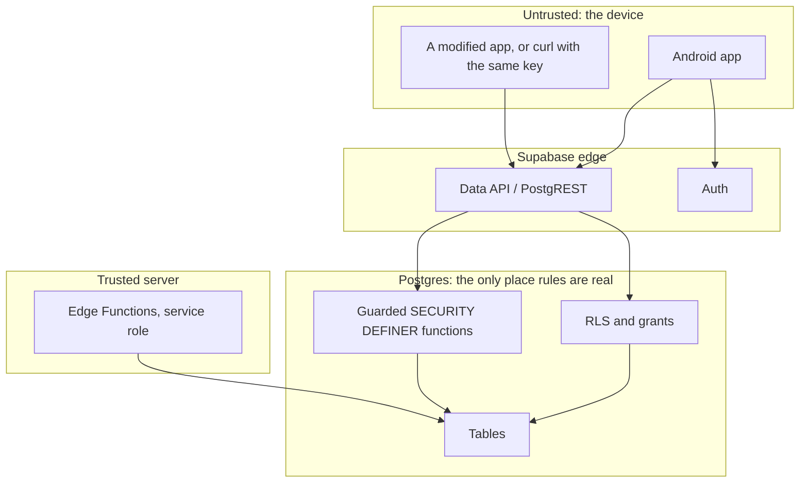

# Schema threat model and exposure matrix

Version: 1.0
Date: 25 July 2026
Status: **Signed off by Jonny on 25 July 2026.** `DB-002` and the migration
cards after it are unblocked. See the sign-off note at the end for the scope of
that approval.

Covers `DB-002` to `DB-019`. Read with `docs/ARCHITECTURE.md`, whose data model
this refines, and `docs/PRD.md`, whose functional requirements it enforces.

## Why this document exists first

Every rule this product sells is a database rule. One vote, no self-vote, no
live standings and above all no administrator learning who voted for whom are
promises that survive only if Postgres refuses to break them. A client-side
check is a suggestion. So the exposure decisions are made here, deliberately,
before any table exists, rather than discovered later by an advisor.

## The one invariant that matters most

> No administrator, and no other member, can learn who cast a given ballot
> through any API this product exposes.

`D-003` is honest that this is confidentiality, not anonymity: the database
stores `nominator_user_id` because eligibility and one-vote enforcement need it.
That makes the storage of voter identity a deliberate, contained risk, and the
containment is the product.

Everything below is in service of that sentence, and any change that weakens it
is a release blocker rather than a trade-off.

## Assets, in order of harm if disclosed

| Asset | Harm if disclosed | Where it lives |
|---|---|---|
| Who voted for whom | Workplace retaliation, coercion, loss of trust; the product's central promise broken | `recognition_nominations.nominator_user_id` |
| Reason free text | May carry sensitive personal data despite warnings; can identify its author by writing style in a small team | `recognition_nominations.reason` |
| Voting patterns over time | Re-identification across cycles; inference about relationships | Nominations joined across cycles |
| Roster email addresses | Phishing of a known employee list; spam | `organisation_invitations.email_normalised` |
| Invitation tokens | Account takeover of an invited identity | `organisation_invitations.token_hash` |
| Cross-tenant anything | Customer-visible breach, contract and UK GDPR consequences | Every table with `organisation_id` |
| Push tokens | Unsolicited notification to a person's device | `device_push_tokens` |
| Winner history | Low. Public inside the organisation by design | `recognition_cycles` winner columns |

Timing metadata is an asset in its own right. In a team of four, `created_at`
on a ballot plus knowledge of who was at their desk is close to an identifier.
Precise nomination timestamps are therefore treated as identifying data, not
neutral audit noise.

## Trust boundaries

The publishable key is public. It ships inside an APK that anyone can unpack,
so it identifies the project and nothing more. Every design decision assumes an
attacker holds it and is speaking to the Data API directly with a valid
authenticated JWT for their own account. **The app is not part of the security
model.** Route guards are courtesy.

## Actors

| Actor | How it is established | Trust |
|---|---|---|
| Signed out | `anon` role | None. Reaches nothing |
| Authenticated, no membership | `authenticated`, valid `auth.uid()` | Own profile only |
| Member | `organisation_members` row, `role = member`, `status = active` | Own organisation's programme data, own ballot |
| Admin | same, `role = admin` | Roster and cycle management. **Never voter identity** |
| Owner | same, `role = owner` | Admin plus ownership and deletion |
| Other-tenant user | Valid account, membership in a different organisation | Must reach nothing here |
| Service role | Edge Functions only | Bypasses RLS. Never in the app |
| `postgres` | Migrations | Not reachable at runtime |

Authorisation derives from `organisation_members` on every request, never from
`raw_user_meta_data`, which the user can edit, and never from JWT claims, which
go stale.

That last point answers the JWT staleness threat directly. A member removed
from an organisation still holds a valid access token until it expires, up to
an hour. Because every policy reads the membership table live rather than
trusting a claim, removal takes effect on the next request rather than on the
next token refresh.

## Exposure decisions

Supabase's 2026 change means new tables are not automatically exposed to the
Data API. This is treated as a feature: nothing is exposed unless it appears in
the table below with an explicit grant.

Two rules apply throughout:

1. **Grants first, RLS second.** RLS filters rows only after a grant lets the
   role touch the table at all. A table with no grant is unreachable regardless
   of policy, and that is the strongest position available. Enable RLS anyway
   on everything exposed, as defence in depth and because an advisor will
   rightly complain otherwise.
2. **A table holding voter identity gets no grant at all.** Not a restrictive
   policy. No grant.

### Table exposure matrix

`authenticated` is the only client role. `anon` receives nothing anywhere.

| Table | Grant to `authenticated` | Row rule | Why |
|---|---|---|---|
| `profiles` | `SELECT`, `UPDATE` | Own row only, `user_id = auth.uid()` | A user manages their own display name. Co-worker names come from `participants`, so no cross-user profile read is needed |
| `organisations` | `SELECT` | Organisations the caller is an active member of | Name and timezone are needed to render the programme |
| `organisation_members` | `SELECT` | Rows in the caller's organisations | Roles are legitimately visible inside a tenant. Writes go through functions so role escalation cannot be a plain `UPDATE` |
| `participants` | `SELECT` on a **column subset** | Active participants in the caller's organisations | The nominee list. Column subset excludes `user_id`, so a member cannot map a roster entry to an auth identity |
| `organisation_invitations` | **none** | n/a | Holds `token_hash` and `email_normalised`. Both are function-only |
| `recognition_cycles` | `SELECT` | Cycles in the caller's organisations | Criteria, dates and status drive the whole member UI |
| `recognition_nominations` | **none** | n/a | **The core decision.** Holds `nominator_user_id`. No client role may select it, including admins |
| `recognition_settings` | `SELECT` on a column subset | Caller's organisations | Retention and criteria template are member-visible for transparency |
| `device_push_tokens` | **none** | n/a | Personal data with no client read case. Registration is a function |
| `notification_deliveries` | **none** | n/a | Server bookkeeping |
| `audit_events` | **none** | n/a | Contains actor and entity references that admit inference. Admin views come from a shaped function |
| `privacy_requests` | **none** | n/a | Status is returned by a function that never discloses another subject's request |

Everything in the `private` schema is unreachable, though not for the reason
this document first gave.

The original wording said `authenticated` holds no `USAGE` on `private`. That
is unimplementable. RLS policy expressions are evaluated with the **caller's**
privileges, so a policy calling `private.is_org_member` requires the querying
role to hold `EXECUTE` on it and `USAGE` on the schema. Without both, every
query on a protected table fails with `permission denied for function`.

So `authenticated` does hold `USAGE` on `private`, plus `EXECUTE` on exactly the
two helpers that appear inside a policy expression. Helpers called only from
`SECURITY DEFINER` functions are deliberately not granted, because a definer
function runs as its owner and needs nothing from its caller.

**The control is the exposed-schema list, not the grant.** PostgREST serves only
the schemas it is configured to expose, `public` and `graphql_public`, so nothing
in `private` is reachable as an RPC whatever privileges exist. Verified against a
running instance: `POST /rest/v1/rpc/is_org_member` returns `PGRST202`, saying it
searched `public` and found no such function.

The correction matters more than the detail. This was a control asserted in a
signed document that would have failed the first time it was implemented, and
only implementing it revealed that.

### The column subset on `participants` is load-bearing

Granting the whole table would expose `user_id`, letting any member join a
roster name to an auth identity. That is not itself a voter leak, but it is the
first half of one, and it removes a layer of work from anyone attempting
correlation.

Granted: `id`, `organisation_id`, `display_name`, `team`, `avatar_path`,
`active`, `can_receive`.

Withheld: `user_id`, `can_vote`, `created_at`, `updated_at`, `left_at`.

`can_vote` is withheld because who is *eligible to vote* narrows the set of
possible authors of a given reason. `can_receive` must be visible because the
nominee list depends on it.

A member still needs to know which participant is their own, which is what
`get_my_participant()` is for. Column privileges are the mechanism, and
PostgREST honours them, returning an error rather than silently dropping a
withheld column.

### Winner columns need no special handling

`winner_participant_id`, `winner_name` and `winner_nominations` sit on
`recognition_cycles`, which members can read. This is safe only because those
columns are written in the same transaction that sets `status = 'revealed'`.
There is no window in which a populated winner is visible on an unrevealed
cycle, so no column-level or view-level hiding is required.

If a future change ever writes a provisional winner before reveal, this
reasoning collapses and `FR-RESULT-01` breaks. That is why the reveal function
must remain the only writer of those columns.

## Function surface

Sensitive behaviour is `SECURITY DEFINER`, owned by a role that is not
`postgres`, living outside the exposed schema, and hardened the same way every
time:

- `REVOKE EXECUTE ON FUNCTION ... FROM PUBLIC` — Postgres grants execute to
  `PUBLIC` by default, so every function is reachable by `anon` until this runs;
- `GRANT EXECUTE` to `authenticated` only, per function;
- `SET search_path = ''` and schema-qualify every reference, so a caller cannot
  shadow a table with a temporary one;
- validate `auth.uid()` inside the function rather than trusting an argument;
- take the organisation from the row being acted on, never from a parameter, so
  a caller cannot assert a tenant they do not belong to.

| Function | Caller | Returns | Refuses |
|---|---|---|---|
| `create_organisation(name, tz)` | Any verified user | New organisation ID | Invalid timezone; unverified email |
| `accept_invitation(token)` | Authenticated | Membership | Expired, consumed, revoked, wrong email, replay |
| `get_my_participant(org)` | Member | Own participant row | Non-member |
| `create_cycle(...)` | Admin, owner | Cycle ID | Duplicate month; non-admin |
| `transition_cycle(id, expected_version, next)` | Admin, owner | New state | Illegal transition; stale version; reopening a revealed cycle |
| `cast_nomination(cycle, nominee, reason, key)` | Member | Confirmation | Closed cycle; self-vote; second vote; cross-tenant; ineligible voter or nominee |
| `withdraw_nomination(cycle)` | Member | Confirmation | Closed cycle; not own ballot |
| `get_my_nomination(cycle)` | Member | **Own** ballot only | Any attempt to read another's |
| `get_cycle_turnout(cycle)` | Admin, owner | Counts only | Any named voter or non-voter |
| `get_admin_nominations(cycle)` | Admin, owner | Shaped, see below | Voter identity; precise timestamps |
| `moderate_nomination(id, action, reason)` | Admin, owner | Confirmation | Missing reason; post-reveal change |
| `get_closed_standings(cycle)` | Admin, owner | Ranked counts | An open cycle |
| `reveal_winner(cycle, tied_id, note)` | Admin, owner | Winner snapshot | Zero ballots; a non-leader; a tie without a note |
| `request_account_deletion()` | Authenticated | Request ID | Sole owner with an undeleted organisation |

### The shaped administrator response

`get_admin_nominations` is where the central invariant is either kept or lost,
so its return type is defined by what it **excludes**:

Returns: nomination ID, nominee participant ID, nominee display name, reason
text, status, moderation fields, and `created_date` truncated to the day.

Never returns: `nominator_user_id`, the voter's participant ID, the voter's
email, `created_at`, `updated_at`, or any ordering that reflects insertion
sequence.

Day-level truncation is not decoration. In a team of five, a timestamp accurate
to the second combined with a lunch break identifies an author. Results are
ordered by nominee display name then nomination ID, never by time, because a
time-ordered list leaks the sequence that truncation was meant to remove.

Per `D-014`, this function refuses to return anything for an open cycle unless
the nomination has been reported, so administrators cannot browse reasons while
voting is live.

## Threats and controls

Ordered by how much damage a miss causes.

### T1. Administrator reads voter identity

*The product's reason to exist.*

An admin authenticates normally and queries `recognition_nominations` through
the Data API, or finds a view, a join or a foreign-key expansion that reaches
it.

Controls: no grant on the table for any client role, so PostgREST cannot reach
it under any policy. No view over it that is not `security_invoker = true`. The
only path is `get_admin_nominations`, whose shape excludes identity. A contract
test asserts the returned column set exactly, so adding a leaking column fails
CI rather than review.

Residual: an admin with the service-role key reads everything. That key exists
only in Edge Function secrets and never in the app. Its exposure is a P0
incident, not a mitigated risk.

### T2. Voter identity inferred rather than read

Harder, and the reason `T1`'s controls are not sufficient on their own. Vectors:
precise timestamps; insertion order; turnout deltas polled repeatedly during an
open cycle; a reason's writing style in a very small team.

Controls: day-level timestamps and non-temporal ordering in the admin response;
turnout as a count with no per-request identity; `D-014` deferring reason access
until close; explicit user warning before free-text entry.

Residual, and it must be stated plainly: **in an organisation of three or four
people, confidentiality is weak no matter what the schema does.** If two of
three votes are visible at close and an admin knows their own, the third is
determined. The product should warn at small roster sizes rather than imply a
guarantee it cannot keep. Raised as an open question below.

### T3. Cross-tenant read or write

A member of organisation A reads or writes organisation B's data by supplying
B's IDs.

Controls: every policy predicate begins with membership of the row's own
organisation, never with a parameter. Every child row carries `organisation_id`
and a composite foreign key `(organisation_id, id)` back to its parent, so a
nomination cannot reference a cycle in another tenant even with direct SQL.
`organisation_id` is immutable after insert, enforced by trigger, so a row
cannot be walked across tenants by update.

### T4. Ballot integrity

Voting twice, voting for oneself, voting in a closed cycle, voting on behalf of
another user, or voting as an ineligible participant.

Controls: unique `(organisation_id, cycle_id, nominator_user_id)`; a check that
the nominee's participant row is not the voter's; cycle status verified inside
the same transaction as the insert rather than read first; `nominator_user_id`
set from `auth.uid()` inside the function and never accepted as an argument.

The recast path is the subtle one. A member may withdraw and vote again while
the cycle is open, which must not become a way to hold two slots. The current
nomination stays one mutable row updated only through guarded functions, with an
immutable `recognition_ballot_events` table carrying the audit trail. The unique
constraint therefore holds throughout.

Idempotency keys make retries safe: a dropped connection after a successful
insert must not produce a second ballot when the client retries.

### T5. Tally and reveal manipulation

Revealing a non-leader, revealing a tie without a decision note, revealing a
cycle with no votes, or re-revealing to change the record.

Controls: the reveal function recomputes standings inside its own transaction
rather than trusting anything the caller passes; a submitted winner must be a
joint leader by that computation; a tie requires a non-empty note; zero ballots
refuses; `revealed` is terminal, enforced by the transition function and a
trigger so even a direct write cannot reopen.

Two administrators acting at once is handled by the expected-version argument,
which turns a lost update into a deterministic failure.

### T6. Invitation abuse

Replaying a used token, redeeming with a different email, brute-forcing tokens,
or reading tokens from the table.

Controls: no client grant on `organisation_invitations`; only a hash is stored,
so a database read does not yield usable tokens; tokens carry enough entropy to
make guessing impractical and expire in seven days; redemption is one
transaction that verifies the authenticated email, marks consumption and creates
membership together, so a replay finds the token already consumed.

Email matching is a claim check during redemption only, never a background
mechanism that links identities.

### T7. Privilege escalation inside a tenant

A member promotes themselves to admin.

Controls: no `UPDATE` grant on `organisation_members`, so role changes exist
only as functions that verify the caller's own role first. Owner-only operations
check for `owner` specifically. Nothing anywhere reads a role from JWT claims or
user metadata.

### T8. Storage

Reading another organisation's avatars, or writing to a path belonging to
someone else.

Controls: a private bucket, no public URLs, short-lived signed reads. Object
paths start with the organisation ID and storage policies verify membership of
that organisation rather than merely parsing the path. MIME allow list of JPEG,
PNG and WebP, 2 MB after client-side processing.

### T9. Retention and deletion

A purge that removes too much, too little, or runs twice.

Controls: purge touches raw nominations of revealed cycles past the cutoff only;
draft, open and closed cycles are never purged; winner snapshots and aggregate
cycle records survive by design; dry-run mode; idempotent by business key.
Deletion revokes sessions and device tokens **before** removing the auth
identity, because deleting a user does not immediately invalidate issued access
tokens.

### T10. Function surface itself

A function reachable by `anon`, or one whose `search_path` lets a caller shadow
a table it references.

Controls: the hardening list above applies to every function without exception,
and `DB-018` re-checks it adversarially rather than trusting that it was done.

## What gets tested, and as whom

Every operation is exercised as: signed out; a member of the same organisation;
an admin of the same organisation; the owner; a member and an admin of a
*different* organisation; and the service role.

Tests must include direct Data API attempts, not only the intended RPC path. A
suite that only proves the happy path proves nothing about exposure, because the
threats above are all about the unintended path.

Named tests that must exist before `DB-006` closes:

1. An admin selecting `recognition_nominations` directly is refused.
2. `get_admin_nominations` returns exactly the agreed column set, asserted by
   name, with a failure if the set grows.
3. A member cannot read another member's nomination by any route, including a
   count or a `HEAD` request.
4. A member of another organisation reaches nothing, on every table.
5. `anon` reaches nothing, including every function.
6. A second `cast_nomination` for the same voter and cycle fails.
7. A self-nomination fails.
8. A nomination into another tenant's cycle fails.
9. Reveal of a non-leader fails; a tie without a note fails; zero ballots fails.
10. A revealed cycle cannot be reopened, including by direct update.
11. `participants` returns no `user_id` column to a member.

## Questions raised, and how they were answered

All four are now decisions in `docs/DECISIONS.md` rather than open items.

1. **Small-team confidentiality.** Warn below eight eligible voters, in the copy
   rather than a footnote, and do not block the cycle. `D-022`, implemented as
   `assessConfidentiality` and required by `FR-CYCLE-04`.
2. **Reason retention against winner retention.** A retained winner snapshot
   keeps the display name and count. Reason text does not survive erasure.
   `D-023`.
3. **Audit granularity.** Accepted: a nomination-cast event identifies the cycle
   and not the voter, so a disputed individual ballot cannot be investigated
   afterwards. This must appear in the terms rather than surface during a
   dispute. `D-024`.
4. **Service-role blast radius.** Service role is acceptable in development.
   Purpose-made per-function roles before production. `D-025`.

## Sign-off

| Role | Name | Date | Decision |
|---|---|---|---|
| Security reviewer | Jonny Allum | 25 July 2026 | Approved |
| Product owner | Jonny Allum | 25 July 2026 | Approved |

### What this sign-off is, and what it is not

Both rows carry the same name. There has been no independent security review,
because at this stage the product has one operator. That is a reasonable
position for a development project holding synthetic data, and it is recorded
here rather than presented as two separate approvals.

`docs/PRD.md` makes RLS coverage and adversarial review release criteria for
closed testing, and `DB-018` is a distinct adversarial pass. Before real
employee data exists, this document should be re-reviewed by someone who did not
write it. That is a release gate, not a backlog item.

This approval unblocks migration work. It does not approve any production
deployment, any Play Store record, or the processing of real employee data.
